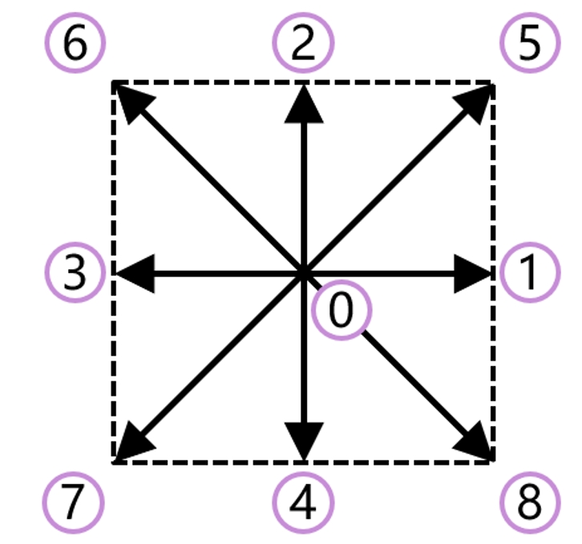

# LBM物理图像
我会先给大家一个物理图像层面的基础认识，然后跟着红宝书学习几个基础的方程求解，**也会逐行代码的进行解读**。最后，当大家基本掌握了LBM的思路后，我们再回过头来分析：为什么LBM可以进行计算，而且算的还挺好。
## 1. LBM计算的基本流程
> 碰撞
$$
f_\alpha ^*(\boldsymbol{x},t) = f_\alpha (\boldsymbol{x},t) - \frac{1}{\tau} [f_\alpha (\boldsymbol{x},t) - f_\alpha ^\mathrm{eq}(\boldsymbol{x},t)]
$$
> 迁移
$$
f_\alpha (\boldsymbol{x} + \boldsymbol{e}_\alpha \delta _t, t + \delta_t) = f_\alpha ^*(\boldsymbol{x},t)
$$
> 计算宏观量
$$
\rho (\boldsymbol{x},t) = \sum _\alpha f_\alpha (\boldsymbol{x},t)
$$
$$
\boldsymbol{u} (\boldsymbol{x},t) = \frac{1}{\rho (\boldsymbol{x},t)} \sum _\alpha f_\alpha (\boldsymbol{x},t) \boldsymbol{e}_\alpha
$$

## 2. 上面各个量的物理意义
- $f_\alpha (\boldsymbol{x},t)$: 在位置$\boldsymbol{x}$，时间$t$，沿着方向$\boldsymbol{e}_\alpha$的粒子分布函数
- $f_\alpha ^*(\boldsymbol{x},t)$: 在位置$\boldsymbol{x}$，时间$t$，沿着方向$\boldsymbol{e}_\alpha$的粒子分布函数在碰撞后的值
- $f_\alpha ^\mathrm{eq}(\boldsymbol{x},t)$: 在位置$\boldsymbol{x}$，时间$t$，沿着方向$\boldsymbol{e}_\alpha$的粒子分布函数的平衡态值
- $\rho (\boldsymbol{x},t)$: 在位置$\boldsymbol{x}$，时间$t$的密度
- $\boldsymbol{u} (\boldsymbol{x},t)$: 在位置$\boldsymbol{x}$，时间$t$的速度

## 3. 分布函数的形式与物理意义
Maxwell-Boltzmann分布函数：
$$f(\boldsymbol{\xi})=n \frac{1}{\left( 2\pi R_\text{g}T\right)^{D/2}}\mathrm{exp}\bigg[ -\frac{\left(\boldsymbol{\xi -u} \right)^2}{2R_\text{g}T}\bigg]$$
其中，$n$是粒子数密度，$R_\text{g}$是气体常数，$T$是温度，$\boldsymbol{\xi}$是粒子的速度，$\boldsymbol{u}$是流体的速度，$D$是维度。$f$平衡态时粒子的概率密度分布。  
格子玻尔兹曼方法里面的**格子**两个字，我认为包含了两层意思，一个是代表了这是这种特殊的时间空间耦合离散方法（之后会介绍），另一个是我们按照格子来离散特定数量的速度方向。这里的速度方向，就是我们上面提到的$\boldsymbol{e}_\alpha$。  
此时，我们可以把将平衡态分布函数$f_\alpha ^\mathrm{eq}$表示为：
$$
\begin{aligned}
f_{\alpha}& =\rho \left( 2\pi R_{_g}T\right)^{-D/2}\exp\left[ -\frac{\left( \boldsymbol{e}_{\alpha}-\boldsymbol{u} \right)^{2}}{2R_{_g}T}\right] \\
&=\rho \left(2\pi R_{\mathrm{g}}T\right)^{-D/2}\exp\left(-\frac{\boldsymbol{e}_{\alpha}^{2}}{2R_{\mathrm{g}}T}\right)\exp\left(\frac{\boldsymbol{e}_{\alpha}\cdot\boldsymbol{u}}{R_{\mathrm{g}}T}-\frac{\boldsymbol{u}^{2}}{2R_{\mathrm{g}}T}\right) \\
&=\rho\omega_{\alpha}\exp\left(\frac{\boldsymbol{e}_{\alpha}\cdot\boldsymbol{u}}{R_{\mathrm{g}}T}-\frac{\boldsymbol{u}^{2}}{2R_{\mathrm{g}}T}\right)  \\
&=\rho\omega_{\alpha}\left[ 1+\frac{\boldsymbol{e}_{\alpha}\cdot \boldsymbol{u}}{R_{_g}T}+\frac{\left(\boldsymbol{e}_{\alpha}\cdot \boldsymbol{u}\right)^{2}}{2R_{_g}^{2}T^{2}}-\frac{\boldsymbol{u}^{2}}{2R_{_g}T}\right]+O\left( \boldsymbol{u}^{3} \right)
\end{aligned}
$$
其中，$\omega_{\alpha}=( 2\pi R_{\mathrm{g}}T)^{-D/2}\exp( -e_{\alpha}^{2}/2R_{\mathrm{g}}T)$是权重因子。上面的展开中的最后一步，我们利用了泰勒展开式$\exp(x)=1+x+x^{2}/2!+O(x^{3})$。  
因此在LBM中，平衡态分布函数普遍采用如下的形式（对流扩散方程的取值会有出入）：
$$
f_{\alpha}^{\mathrm{eq}}=\rho\omega_{\alpha}\left[1
+\frac{\boldsymbol{e}_{\alpha}\cdot \boldsymbol{u}}{c_s^2}+\frac{\left(\boldsymbol{e}_{\alpha}\cdot \boldsymbol{u}\right)^{2}}{2c_s^4}-\frac{\boldsymbol{u}^{2}}{2c_s^2}\right]
$$
这里，不同的离散速度模型会有不同的权重因子$\omega_{\alpha}$。
## 4. BGK碰撞算法
Boltzmann方程：
$$
\frac{\partial f}{\partial t}+\boldsymbol{\xi} \cdot \frac{\partial f}{\partial \boldsymbol{r}}+a\cdot \frac{\partial f}{\partial \boldsymbol{\xi}}=\iint(f^{\prime}f_{1}^{\prime}-ff_1)d_{D}^{2}\mid g\mid \cos \theta \mathrm{d}\Omega \mathrm{d}\xi _1
$$
这里的$f(\boldsymbol{r},\boldsymbol{\xi},t)$是指某一时刻$t$，某一位置$\boldsymbol{x}$处，速度为$\boldsymbol{\xi}$的粒子数。右侧是碰撞项，是一个很复杂的积分。这里用到：
$$
\begin{aligned}
\frac{\mathrm{d}f(\boldsymbol{r},\boldsymbol{\xi},t)}{\mathrm{d}t}
&=\frac{\partial f}{\partial t}+\frac{\partial f}{\partial \boldsymbol{r}}\cdot \frac{\mathrm{\partial \boldsymbol{r}}}{\mathrm{d}t}+\frac{\partial f}{\partial \boldsymbol{\xi}}\cdot \frac{\mathrm{\partial \boldsymbol{\xi}}}{\partial t}\\
&=\frac{\partial f}{\partial t}+\boldsymbol{\xi} \cdot \frac{\partial f}{\partial \boldsymbol{r}}+\boldsymbol{a}\cdot \frac{\partial f}{\partial \boldsymbol{\xi}}
\end{aligned}
$$
BGK假设：
$$
\frac{\partial f}{\partial t}+\boldsymbol{\xi} \cdot \frac{\partial f}{\partial \boldsymbol{r}}+a\cdot \frac{\partial f}{\partial \boldsymbol{\xi}} = -\frac{1}{\tau_0}(f-f^{\mathrm{eq}})
$$
因此我们可以得到Boltzmann-BGK方程（暂时不考虑速度随时间的变化，即$\boldsymbol{a}=0$）：
$$
\frac{\mathrm{d}f_\alpha}{\mathrm{d}t}
=\frac{\partial f_\alpha}{\partial t}+\boldsymbol{e}_\alpha \cdot \nabla f_\alpha = -\frac{1}{\tau_0}(f_\alpha-f_\alpha^{\mathrm{eq}})
$$
这里我们给出了**碰撞**过程的基础认识。
## 5. **格子**离散化
上式如果不考虑源项，那么他就是一个**最典型的对流方程**，以它的一维度形式来举例：
$$
\frac{\mathrm{d}f_\alpha}{\mathrm{d}t}=\frac{\partial f_\alpha}{\partial t}+a\frac{\partial f_\alpha}{\partial x} = 0
$$
给定0时刻$f_\alpha(x,0)$，那么这个方程的解就是$f_\alpha(x,t)$以$a$的速度向右传播。典型图像如下：

 <!--  -->
 {width="200px"}

重新写一下Boleman-BGK方程：
$$
\frac{\mathrm{d}f_\alpha}{\mathrm{d}t} = -\frac{1}{\tau_0}(f_\alpha-f_\alpha^{\mathrm{eq}})
$$
将上式从$\delta_t$积分到$\delta_t+\delta_t$，得到：
$$
\begin{aligned}
&\int_{t}^{t+\delta_t}\frac{\mathrm{d}f_\alpha}{\mathrm{d}t}\mathrm{d}t=-\frac{1}{\tau_0}\int_{t}^{t+\delta_t}(f_\alpha-f_\alpha^{\mathrm{eq}})\mathrm{d}t\\
&\int_{t}^{t+\delta_t}\frac{f(\boldsymbol{x}+\boldsymbol{e}_\alpha \delta_t,t+\delta_t)-f(\boldsymbol{x},t)}{\delta_t}\mathrm{d}t=-\frac{1}{\tau_0}\int_{t}^{t+\delta_t}[f_\alpha(\boldsymbol{x},t)-f_\alpha^{\mathrm{eq}}(\boldsymbol{x},t)]\mathrm{d}t\\
&f(\boldsymbol{x}+\boldsymbol{e}_\alpha \delta_t,t+\delta_t)-f(\boldsymbol{x},t)=-\frac{\delta_t}{\tau_0}[f_\alpha(\boldsymbol{x},t)-f_\alpha^{\mathrm{eq}}(\boldsymbol{x},t)]\\
&f(\boldsymbol{x}+\boldsymbol{e}_\alpha \delta_t,t+\delta_t)=f(\boldsymbol{x},t)-\frac{1}{\tau}[f_\alpha(\boldsymbol{x},t)-f_\alpha^{\mathrm{eq}}(\boldsymbol{x},t)]
\end{aligned}
$$
其中，$\delta_t$是时间步长，$\tau = \tau_0 /\delta_t$。上式有一个当$\delta_t$任意取时，$f(\boldsymbol{x}+\boldsymbol{e}_\alpha \delta_t,t+\delta_t)$不知道存储在哪里，因此针对$\boldsymbol{e}_\alpha$的取值，$\delta_t$需要取特定的值，使得$f(\boldsymbol{x}+\boldsymbol{e}_\alpha \delta_t,t+\delta_t)$正好落在临近的格点上。即，在LBM中空间步长和时间步长时耦合在一起的。也正是由于耦合在一起，LBM具有时空二阶精度。  
 

## 6. 总结
如果从一个讲故事的角度出发，我们可以这样理解LBM：  
- LBM的理论出发点是Boltzmann方程。但是由于Boltzmann方程的复杂性，我们无法直接求解
- 因此我们使用BGK方程简化了Boltzmann方程。BGK简化中使用了展开的Maxwell分布求解平衡态分布函数
- BGK方程是$\alpha$个对流方程，我们在求解时使用了格子离散化的方法，将空间和时间耦合在一起，使得LBM具有时空二阶精度
- 最后我们得到了一个LBM的基本流程：碰撞、迁移、计算宏观量

> **其实我认为，在数学上，LBM的优势是可以将一个很难求解的非线性方程（比如NS方程）转化为几个很好求解的对流方程来求解** 

> **同时这里的对流方程也不仅仅局限于使用格子离散法来求解，也可以使用有限差分、有限体积、DG等方法来求解**
